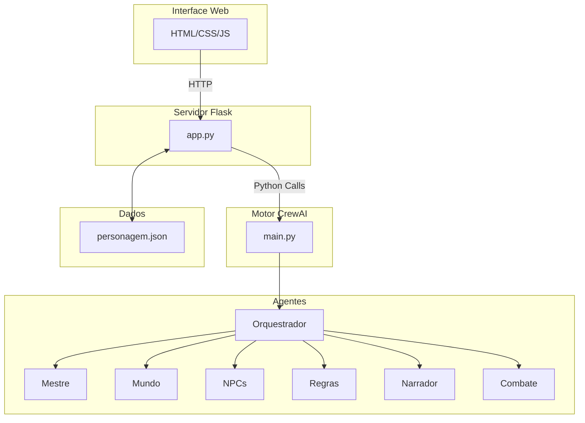
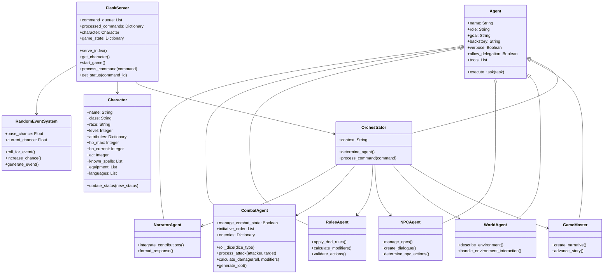
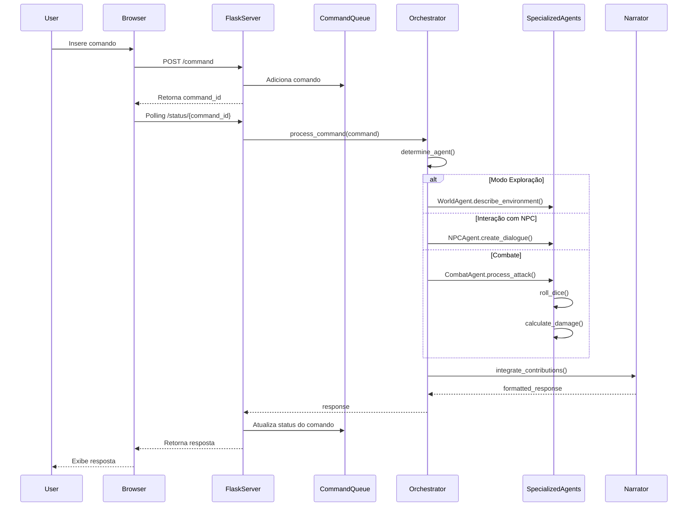
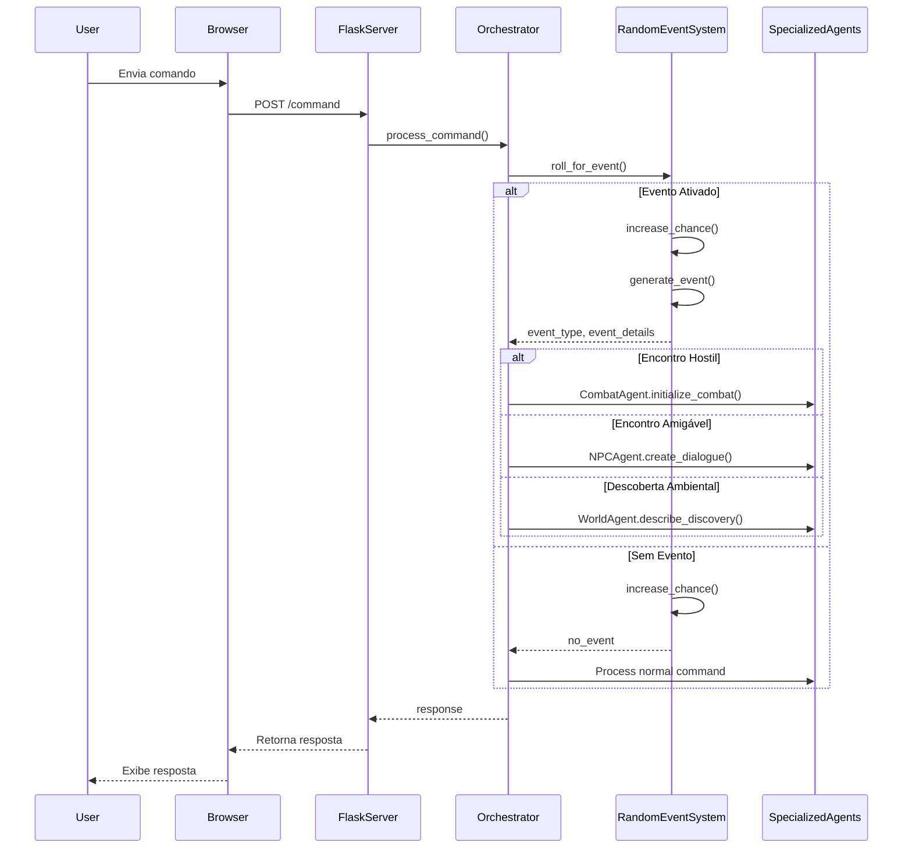
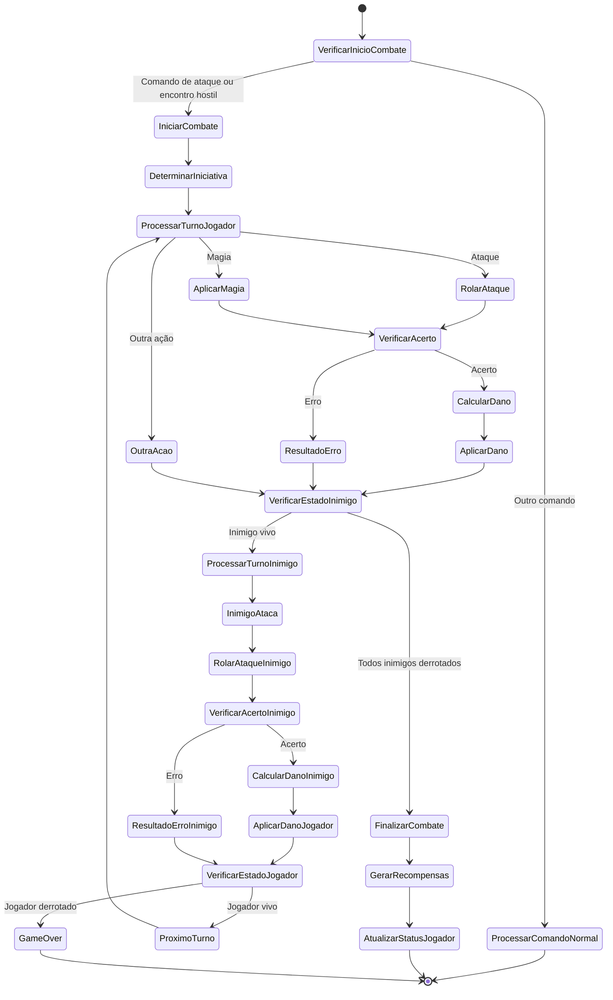
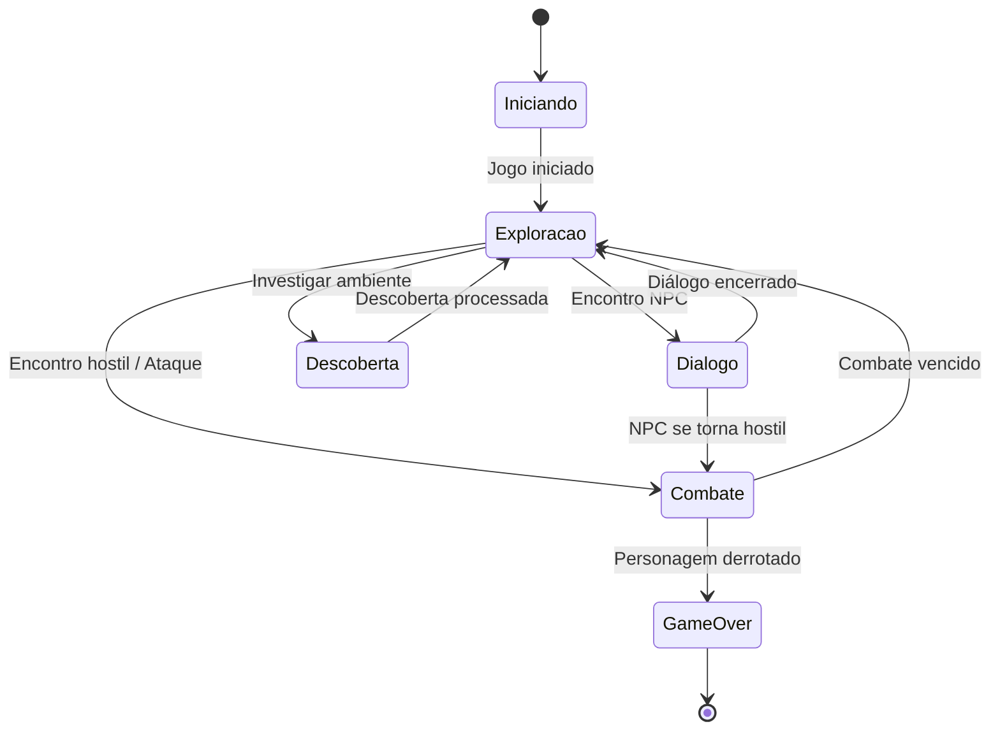
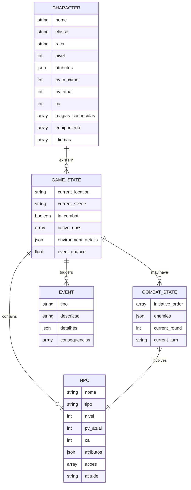

# Documentação UML - RPG_COM_IA

## Visão Geral do Sistema

Este documento apresenta a modelagem UML do sistema RPG_COM_IA, um jogo de RPG solo baseado em D&D 5e que utiliza múltiplos agentes de IA através da biblioteca CrewAI.

## Diagrama de Componentes



## Diagrama de Classes



## Diagrama de Sequência: Processamento de Comando



## Diagrama de Sequência: Sistema de Eventos Aleatórios



## Diagrama de Atividades: Fluxo de Combate



## Diagrama de Estados: Estados do Jogo



## Diagrama Entidade-Relacionamento



## Requisitos do Sistema

### Requisitos Funcionais

1. **RF01** - O sistema deve permitir ao usuário criar e controlar um personagem D&D 5e.
2. **RF02** - O sistema deve processar comandos em linguagem natural do usuário em tempo real.
3. **RF03** - O sistema deve simular combates baseados nas regras D&D 5e.
4. **RF04** - O sistema deve gerar eventos aleatórios durante a exploração.
5. **RF05** - O sistema deve fornecer descrições detalhadas do ambiente.
6. **RF06** - O sistema deve simular diálogos com NPCs.
7. **RF07** - O sistema deve aplicar as regras do D&D 5e para todas as ações.
8. **RF08** - O sistema deve gerenciar o inventário e status do personagem.
9. **RF09** - O sistema deve gerar recompensas após combates vencidos.

### Requisitos Não-Funcionais

1. **RNF01** - O sistema deve responder a comandos em menos de 10 segundos.
2. **RNF02** - O sistema deve fornecer feedback visual durante o processamento.
3. **RNF03** - A interface deve ser responsiva e funcionar em diferentes dispositivos.
4. **RNF04** - O sistema deve manter estado entre sessões.
5. **RNF05** - O sistema deve tratar adequadamente erros de conexão.

## Implementação

### Tecnologias Utilizadas

- **Backend**: Python, Flask, CrewAI
- **APIs**: OpenAI API (GPT)
- **Frontend**: HTML, CSS, JavaScript puro
- **Persistência**: JSON

### Estrutura de Arquivos

```
Estrutura do Projeto RPG_COM_IA
RPG_COM_IA/
├── .idea/
├── .venv/
├── app/
│   ├── static/
│   │   ├── css/
│   │   │   └── style.css   # Estilos
│   │   └── js/
│   │       └── main.js     # Lógica frontend
│   ├── templates/
│   │   └── index.html      # Interface do usuário
│   ├── __init__.py
│   ├── app.py              # Servidor Flask
│   ├── main.py             # Motor CrewAI e agentes 
│   └── personagem.json     # Dados do personagem
├── .env                    # Variáveis de ambiente (API keys)
├── README.md               # Documentação
└── requirements.txt      
```

## Configuração e Instalação

1. **Pré-requisitos**:
   - Python 3.12+
   - Conta OpenAI com API key

2. **Instalação**:
   ```bash
   git clone https://github.com/eduardocastro-dev/RPG_COM_IA.git
   cd RPG_COM_IA
   pip install flask crewai langchain-openai python-dotenv
   ```

3. **Configuração**:
   - Crie um arquivo `.env` com sua chave API:
     ```
     OPENAI_API_KEY="sua_chave_api_aqui"
     ```

4. **Execução**:
   ```bash
   python app.py
   ```

## API RESTful

| Endpoint | Método | Descrição | Parâmetros |
|---------|--------|-----------|------------|
| `/` | GET | Página inicial | - |
| `/character` | GET | Obter dados do personagem | - |
| `/start` | GET | Iniciar jogo | - |
| `/command` | POST | Enviar comando | `command` (texto) |
| `/status/<command_id>` | GET | Verificar status do comando | `command_id` |

## Extensões e Melhorias Futuras

1. Implementação de múltiplos cenários e campanhas
2. Sistema de persistência de jogos salvos
3. Geração de mapas visuais
4. Suporte a múltiplos personagens (grupo)
5. Customização de campanhas pelo usuário
6. Interface de voz para comandos
7. Sistema de progressão e experiência expandido
